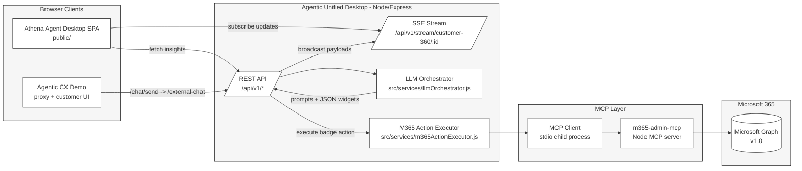
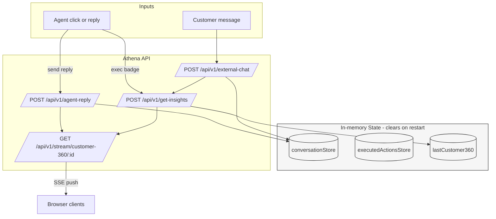
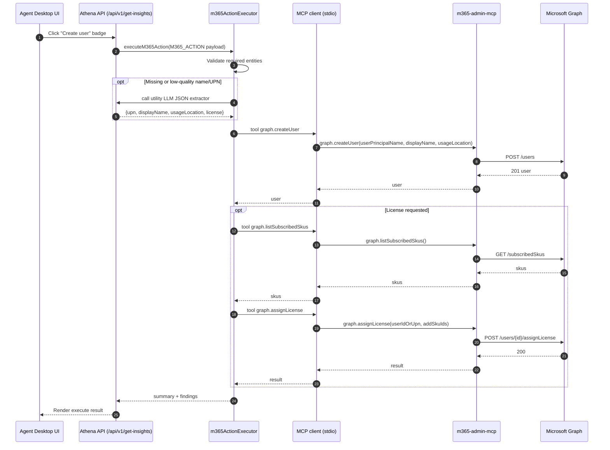

# Athena Cognitive Desktop (Agentic Unified Desktop)

A modular, real-time SPA for contact-center agents. It serves a web UI and an API that orchestrates insights with either OpenAI/Azure OpenAI or Neuro® SAN, and streams Customer 360 updates to clients via Server-Sent Events (SSE).

## Quick start

Prereqs:
- Node.js 18+ and npm
- macOS/Linux/Windows

Setup and run:

# Athena Cognitive Desktop (athena)

A modular, real-time SPA for contact-center agents. It serves a web UI and an API that orchestrates insights with either OpenAI/Azure OpenAI or Neuro® SAN, and streams Customer 360 updates to clients via Server-Sent Events (SSE).

## Quick start

Prereqs:
- Node.js 18+ and npm
- macOS/Linux/Windows

Setup and run:

```bash
# In Agentic Unified Desktop/
npm install

# Configure environment (edit .env — do not commit secrets)
# Then start the server
npm run start:debug
# or
npm start
```

Open the desktop UI:
- http://localhost:3001/

Tip: Append `?cust=random` to pick a demo customer ID at random.

## Architecture

This repo is organized around a Node/Express “desktop backend” that serves a vanilla JS SPA and exposes a small API surface for:
- Ingesting customer utterances
- Orchestrating insight widgets via an LLM
- Streaming updates to connected UIs via SSE
- Executing deterministic Microsoft 365 actions via an MCP server (Microsoft Graph)

### Components (high level)



### Data flow and state

The backend uses in-memory stores (cleared on process restart) to keep the demo fast and dependency-light.



### Microsoft 365 admin execution (MCP)

When an agent clicks an action badge that includes an `M365_ACTION:` payload, the server executes it deterministically:



### Rich architecture doc (HTML)

For a shareable, “single-page doc” architecture view (with Mermaid rendering in the browser), see:
- `docs/architecture.html`

For an audience-facing infographic page (animated, presentation-ready), see:
- `docs/architecture-infographic.html`

## Environment

Set these in `.env` (examples only; replace with your own values):

- ENDPOINT_URL: Azure OpenAI/OpenAI base URL (e.g., https://your-aoai.openai.azure.com/)
- DEPLOYMENT_NAME: Model deployment (e.g., gpt-4o)
- AZURE_OPENAI_API_KEY: Your API key (keep private)
- AZURE_OPENAI_API_VERSION: Optional; defaults to 2025-01-01-preview in code
- AGENT_ACTIONS_PROVIDER: Default orchestration provider when UI doesn’t supply one. Options: `openai` | `neurosan`
- NEUROSAN_BASE_URL: Base URL for Neuro® SAN (e.g., http://localhost:8080)
- NEUROSAN_USE_STREAMING: `true` | `false` (use `/streaming_chat` when true)
- NEUROSAN_NETWORK and NEUROSAN_NETWORK_*: Default/override network names for widgets
- LLM_REQUEST_TIMEOUT_MS: Default LLM timeout (ms)
- NEUROSAN_TIMEOUT_MS: Neuro-SAN request timeout (ms)
- NEUROSAN_EXEC_SUMMARY_MAX: Max chars for execution summaries
- SUPPRESS_AUTO_BOT_REPLY: Set to `true` to omit server-generated `botReply` in `/external-chat` responses and SSE
- PORT: Optional (default 3001)

### Microsoft 365 (Graph) credentials

Athena can execute Microsoft 365 admin actions (create user, disable/delete user, assign licenses, check assignments) via Microsoft Graph using an Entra ID app registration (client credentials flow).

**1) Create an app registration (Entra ID)**
- Azure Portal → Microsoft Entra ID → App registrations → New registration
- Name: e.g. `athena-m365-admin`
- Supported account types: “Accounts in this organizational directory only”
- Register

**2) Create a client secret**
- App registration → Certificates & secrets → New client secret
- Copy the *secret value* (not the secret ID). Store it securely.

**3) Add Microsoft Graph Application permissions**
- App registration → API permissions → Add a permission → Microsoft Graph → Application permissions
- Minimum typically needed for the flows in this repo:
  - `Organization.Read.All` (seat/subscribed SKU queries)
  - `User.ReadWrite.All` (create/update/disable/delete users, assign licenses)
  - `Directory.ReadWrite.All` (some tenant/user directory operations)
- Click “Grant admin consent” for the tenant.

Note: If you see `403` / `insufficient privileges` during execution, it usually means the permission set or admin consent is incomplete.

**4) Configure Athena `.env`**

Add these to `Agentic Unified Desktop/.env`:
- `AZURE_TENANT_DOMAIN` (e.g. `crmBc395940.onmicrosoft.com`)
- `AZURE_CLIENT_ID` (App registration → Overview → Application (client) ID)
- `AZURE_CLIENT_SECRET` (the secret value from step 2)

Security note: never commit real tenant credentials or secrets.

Security note: never commit real API keys.

## UI behavior

- Active customer ID can be provided via the URL: `?cust=<ID>` or `?cust=random`.
- Demo ID pool: `GB26669607`, `GB13820473`, `GB22446688`, `GB77553311`, `GB99001234`.
- “Agent Network Actions” lets you switch orchestration engine (Neuro‑SAN vs OpenAI).
- SSE pushes keep the UI updated with Customer 360, sentiment/risk, NBA, and agent replies.

## API and streaming

Base path: `/api/v1`

- POST `/api/v1/get-insights`
  - Body: `{ customerId, conversationHistory?, requestedWidgets: string[], extraVarsMap?, providerMap? }`
  - Returns: a map keyed by widget name with normalized JSON payloads

- POST `/api/v1/external-chat`
  - Body: `{ customerId, message }`
  - Returns: `{ customer360, wordcloud, insights, botReply?, traceId }`
  - Notes: If `SUPPRESS_AUTO_BOT_REPLY=true`, `botReply` is omitted
  - Side effects: broadcasts the payload over SSE to subscribers of this customer

- GET `/api/v1/stream/customer-360/:id` (SSE)
  - Streams the latest snapshot on connect and subsequent updates. Examples:
    - External chat update: `{ customer360, wordcloud, insights, botReply?, traceId }`
    - Agent reply: `{ type: "agentReply", customerId, message, traceId, ts }`

- POST `/api/v1/agent-reply`
  - Body: `{ customerId, message }`
  - Emits an `agentReply` SSE event

- GET `/api/v1/customer-360/:id`
  - Returns the last known snapshot

## Pairing with the CX Demo

Run the CX Demo (see its README), then open:
- http://localhost:4002/?athena=http://localhost:3001&cust=random

The CX demo forwards customer messages to `/api/v1/external-chat` and subscribes to `/api/v1/stream/customer-360/:id`.

## Troubleshooting

- No updates? Start with `npm run start:debug` and check logs.
- Duplicate replies? Use `traceId` to de-duplicate on the client.
- Not seeing `botReply`? Ensure `SUPPRESS_AUTO_BOT_REPLY` is unset/false.
- CORS: Enabled; if embedding elsewhere, confirm allowed origins.

## License

MIT
